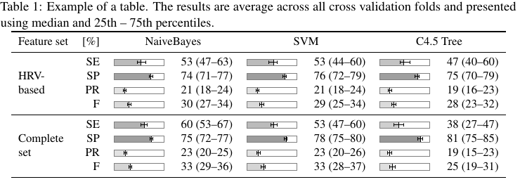

# Latex table with the TikZ package

The graphical package TikZ can be used in easy way to provide fancy looking table with improved readability.
The following commands produce a box, which fill corresponds to a median value.
Then confidence intervals are added to the median value. The box spans one row and the actual numbers span the adjacent row. 

**Commands to draw a box:**

```latex
\newcommand{\drawBox}[3]
{
  \begin{tikzpicture}
  \def\w{1.5} % width of a box
  \def\x{#1/100*\w} % median value
  \def\xl{#2/100*\w} % lower confidance interval
  \def\xu{#3/100*\w} % upper confidance interval
  % draw rectangle (black border)
  \filldraw[fill=gray!#1!white!, draw=black] (0,0) rectangle (\x,0.2); 
  \draw [gray] (0,0) rectangle (\w,0.2); % fill with the grey
  % draw  upper confidance interval
  \draw (\x,0.1) -- (\xu,0.1) -- (\xu,0.15) -- (\xu,0.05);
  % draw lower confidance interval
  \draw (\x,0.1) -- (\xl,0.1) -- (\xl,0.15) -- (\xl,0.05); 
  \end{tikzpicture} 
}
```


**The interface command for tables:**

```latex
  \newcommand{\boxNumberConf}[3]
  % NOTICE the & for a column separation
  {\drawBox{#1}{#2}{#3} & #1 (#2--#3)} 
```

**Example of use:**

```latex
  \boxNumberConf{50}{45}{55} % {median}{lower CI}{upper CI}
```

**Example of results presentation in a Table:**

```latex
\begin{table}[ht!]\small
\centering
\caption{\label{tab:classification_feature_sel} Classification results for 
different groups. The results are average across all folds of CV (50x4 folds CV) and presented using median (25th -- 75th) percentiles.}

\begin{tabular}{p{1.5cm} r lr lr lr}
\toprule
Feature set&[\%]&  \multicolumn{2}{c}{NaiveBayes} &  \multicolumn{2}{c}{SVM} & \multicolumn{2}{c}{C4.5 Tree}\\
\midrule
\multirow{4}{1.5cm}{HRV-based} 
&SE & \boxNumberConf{53}{47}{63} &  \boxNumberConf{53}{44}{60} & \boxNumberConf{47}{40}{60}\\
&SP & \boxNumberConf{74}{71}{77} &  \boxNumberConf{76}{72}{79} & \boxNumberConf{75}{70}{79}\\
&PR & \boxNumberConf{21}{18}{24} &  \boxNumberConf{21}{18}{24} & \boxNumberConf{19}{16}{23}\\
&F  & \boxNumberConf{30}{27}{34} &  \boxNumberConf{29}{25}{34} & \boxNumberConf{28}{23}{32}\\
\midrule
\multirow{4}{1.5cm}{Complete set}
&SE & \boxNumberConf{60}{53}{67} &  \boxNumberConf{53}{47}{60} & \boxNumberConf{38}{27}{47}\\
&SP & \boxNumberConf{75}{72}{77} &  \boxNumberConf{78}{75}{80} & \boxNumberConf{81}{75}{85}\\
&PR & \boxNumberConf{23}{20}{25} &  \boxNumberConf{23}{20}{26} & \boxNumberConf{19}{15}{23}\\
&F  & \boxNumberConf{33}{29}{36} &  \boxNumberConf{33}{28}{37} & \boxNumberConf{25}{19}{31}\\
\bottomrule
\end{tabular}
\end{table}
```




Latex code for a minimal working example
----------------------------------------

```latex
  \documentclass[a4paper,11pt,oneside]{report}
  \usepackage[english]{babel}

  \usepackage{tikz}

  \newcommand{\drawBox}[3] % drawing the bog
  {
  \begin{tikzpicture} 
  \def\w{1.5} % width of a box
  \def\x{#1/100*\w} % median value
  \def\xl{#2/100*\w} % lower confidance interval
  \def\xu{#3/100*\w} % upper confidance interval
  \filldraw[fill=gray!#1!white!, draw=black] (0,0) rectangle (\x,0.2);
  \draw [gray] (0,0) rectangle (\w,0.2); % fill with the grey
  \draw (\x,0.1) -- (\xu,0.1) -- (\xu,0.15) -- (\xu,0.05);
  \draw (\x,0.1) -- (\xl,0.1) -- (\xl,0.15) -- (\xl,0.05);
  \end{tikzpicture} 
  }

  \newcommand{\boxNumberConf}[3] % interface command
  {\drawBox{#1}{#2}{#3} & #1 (#2--#3)} % NOTICE the & for col. sep.

  %%%%%%%%%%%%%%%%%%%%%%%%

  \begin{document}

  \begin{tabular}{l r lr}
  & \multicolumn{2}{c}{mean (95\% CI)} \\
  Sensitivity & \boxNumberConf{74}{65}{81} \\
  Specificity & \boxNumberConf{90}{81}{95} \\
  \end{tabular}

  \end{document}
```

**Results of the minimal example:**


